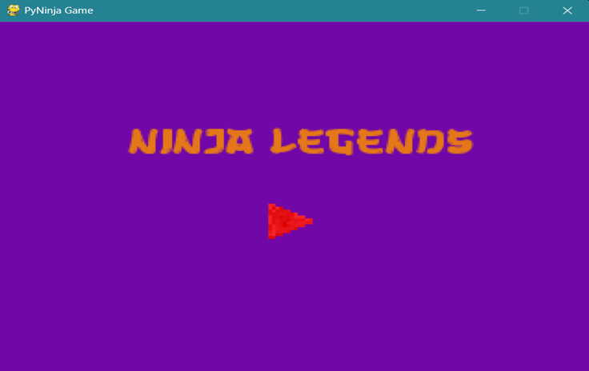
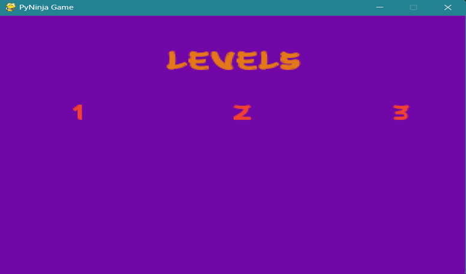
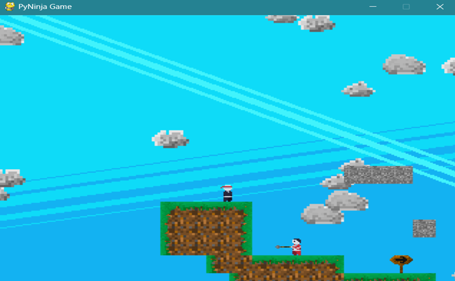
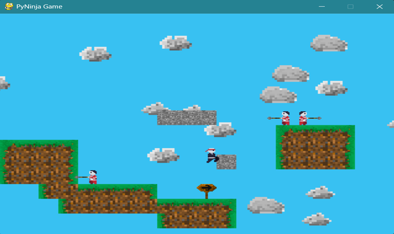
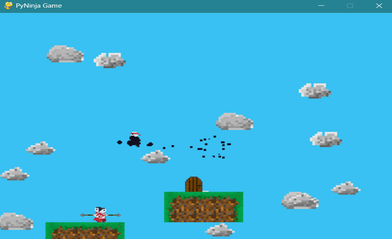
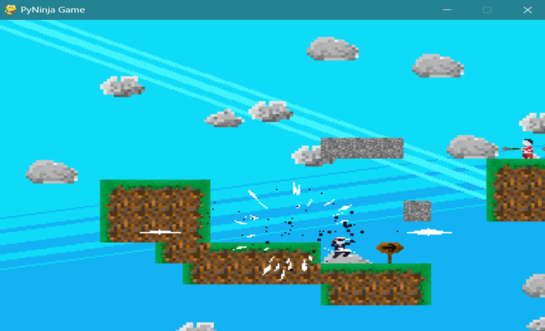

# Ninja Legends Game

## Abstract

Using the Pygame framework, the Ninja Legends game offers a dynamic and captivating gameplay experience. Players control a proficient ninja navigating through challenging stages filled with obstacles, opponents, and tactical possibilities in this 2D side-scrolling platformer. Pygame's rich feature set is leveraged to provide an immersive environment, fluid animations, and responsive controls.

## Introduction

The Pygame framework serves as a fundamental component in the development of the Ninja Legends game, offering a user-friendly and adaptable platform for creating complex, immersive landscapes. This project showcases how Pygame's technical expertise, coupled with artistic vision which, can create a traditional side-scrolling platformer.

## Technology Used

The Ninja game created with Pygame involves various Python concepts and game development principles, including Object-Oriented Programming (OOP), inheritance, modules and libraries, lists and dictionaries, control statements, and mathematical calculations.

## Results

Ninja Legends successfully incorporates various Python concepts and Pygame features to create an enjoyable gaming experience. The game includes responsive controls, dynamic movements, and a progression system through different levels. The use of Pygame has improved the game's responsiveness and reduced the development cycle.

||
|:-------:|
|*Figure 1: Start Page*|

*Figure 2: Level Menu*

*Figure 3: Level 1 of the game*

*Figure 4: Enemies and player jumping between tiles*

*Figure 5: Player in the middle of dash attack*

*Figure 6: Player has killed the enemy*
